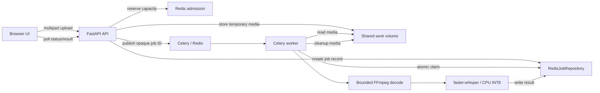

# Media Transcriber

An asynchronous, CPU-only English transcription service. Upload one audio or video file, poll a job, and receive a short-lived transcript. The unauthenticated API is exposed under `/api`; the Docker image serves the compiled React/TypeScript UI from the same FastAPI process.

## Quick start

Docker Desktop or another Compose-compatible Docker engine is required. The verified benchmark environment provided four CPUs and about 8 GiB of VM memory. That is measured environment information, not a minimum requirement.

```sh
docker-compose up --build -d --wait --wait-timeout 600
```

The installed environment used the legacy `docker-compose` executable. If your installation provides the Compose plugin instead, use the equivalent `docker compose up --build -d --wait --wait-timeout 600`. Compose binds the API to `127.0.0.1:8000` by default; Redis is not published externally. Open <http://localhost:8000> when the health check is ready.

The worker downloads the pinned model and loads it during worker initialization/startup. `/health` remains unavailable (`503`) until Redis, temporary storage, the worker heartbeat, and model readiness are all available. The first startup is therefore slower; the first accepted transcription does not separately pay the model-download cost when the worker is already ready.

The supported Compose flow needs no host Python, Node, FFmpeg, GPU, Hugging Face token, or media download. Copy `.env.example` to `.env` only when changing the documented Compose-passed limits.

## Verification

The following commands were run successfully in this repository. The backend requires Python 3.11 and the locked dependencies, a local Redis instance, and host FFmpeg. The frontend requires Node/npm.

Start a temporary test-only Redis with persistence disabled, then run the backend suite:

```sh
redis-server --port 6380 --save "" --appendonly no
TEST_REDIS_URL=redis://127.0.0.1:6380/15 .venv/bin/python -m pytest tests/test_backend.py tests/test_media.py tests/unit/test_transcription_service.py -q
```

The recorded result was `17 passed` with one upstream AnyIO/Starlette TestClient deprecation warning. Stop the temporary Redis process after the test. FFmpeg is used by the media tests and must be installed and on `PATH`.

From `frontend/`, run the TypeScript check and production build:

```sh
npx tsc -b
npm run build
```

Run the frontend tests with the compatibility flag required by the verified Node 25 host:

```sh
NODE_OPTIONS=--no-experimental-webstorage npm test
```

The recorded result was `5 passed`; the build transformed 31 modules. The planned Docker build uses Node 22 and does not need that host-specific flag.

Optional end-to-end smoke test, using the supplied `sample-speech-5m.mp3`, is the verified Compose command:

```sh
docker-compose up --build -d --wait --wait-timeout 600
```

The checkpoint then verified `GET /health`, `queued → processing → completed`, and ordinary work-directory cleanup before bringing the stack down. It did not verify one-hour input, AMD64/Intel execution, accuracy/WER, interruption recovery, or repeated-job memory behavior.

## API and limits

The local public flow has one upload-and-submit endpoint followed by polling:

```sh
curl -F 'file=@my-recording.mp3' http://localhost:8000/api/transcriptions
curl http://localhost:8000/api/transcriptions/JOB_ID
```

`POST /api/transcriptions` returns `202` with a job ID and status URL. Poll `GET /api/transcriptions/{id}` until `completed` (transcript and duration) or `failed` (safe error). Unknown or expired IDs return `404`; capacity returns `429`; unavailable infrastructure returns `503`. The browser does not coordinate separate upload and job-creation endpoints: React/TypeScript submits the single multipart request, then polls.

The defaults are bounded: 4 GiB upload bytes, 3,600 seconds maximum duration, three active jobs, 7,200 seconds processing timeout, and a 24-hour result TTL. Accepted media is WAV, MP3, M4A, MP4, or WebM only when the first audio stream uses a supported codec. High-bitrate video may exceed the byte limit even when shorter than one hour.

Duration is authoritatively checked after bounded FFmpeg decoding. Container metadata may be missing or misleading, so metadata alone is not accepted as proof that an input is within the limit.

## Architecture and replaceable contracts

Application services depend on four replaceable contracts: `JobRepository`, `MediaStorage`, `TaskDispatcher`, and `TranscriptionEngine`. Redis, local storage, Celery, FFmpeg, and faster-whisper are infrastructure adapters behind those boundaries. Changing an adapter should not require rewriting business orchestration.

The repository pattern is used explicitly: the current `RedisJobRepository` implements `JobRepository` and stores temporary job records in Redis. The current flow is:



The request is deliberately handled in stages:

1. The API reserves an admission slot before accepting the upload. This bounds the number of uploads, queued jobs, and expensive processing tasks that can compete for disk and memory.
2. The API writes the upload to temporary storage using a generated job ID, creates the queued job record, and publishes only that ID to Celery. If publication fails, it compensates by removing the temporary record/file and releasing the reservation rather than returning a misleading `202`.
3. The worker atomically changes the job from `queued` to `processing`. A duplicate delivery therefore cannot start a second transcription for the same job.
4. The worker reads the trusted temporary path, uses bounded FFmpeg decoding to validate duration and create normalized mono 16 kHz audio, then passes that audio to the already-loaded CPU model. Keeping decoding and inference in the worker leaves the API responsive.
5. The worker writes either a completed transcript or a safe failure to the job record. The browser learns the result by polling the API; it never needs access to Redis, Celery, the filesystem, or model internals.
6. Finally, ordinary cleanup removes temporary media and releases the admission slot. Redis records and model weights remain only for their configured short-lived or caching purposes, so restart recovery is intentionally limited in this local design.

### Processing details

For one accepted job, the worker performs these processing steps:

1. **Probe the media.** `ffprobe` checks the container, selects the first audio stream, requires a supported codec, and rejects files with no audio track.
2. **Decode and normalize.** FFmpeg decodes only the selected audio stream, ignores video/subtitle/data streams, converts it to mono 16 kHz signed 16-bit PCM WAV, and stops after the configured duration limit plus a small detection margin.
3. **Verify decoded duration.** The worker reads the generated WAV frame count and calculates duration from samples. This decoded duration—not a potentially misleading container header—is used for the authoritative limit check.
4. **Run transcription.** The already-loaded faster-whisper CPU INT8 model reads the normalized WAV. The runtime uses PyAV for audio reading, while the application fully consumes the returned segment iterator before saving the transcript.
5. **Apply voice-activity filtering.** faster-whisper runs with `vad_filter=True`, so likely non-speech regions are excluded from transcription segments. The current implementation does not report how much silence VAD removed and does not rewrite the WAV; a statement such as “VAD removed 4:51” would require additional instrumentation.
6. **Persist the result.** The worker joins the surviving segment text, stores the transcript and decoded media duration, and then removes temporary input and normalized-audio files.

Only an opaque job ID crosses the local Celery boundary; media bytes remain in the shared Docker `work` volume. Replacing an adapter does not automatically provide identical capabilities, durability, delivery guarantees, migration behavior, or recovery semantics. Those properties belong to the chosen implementation and its operational design.

## Temporary data and honest limitations

`work` contains upload and normalized-audio files only while needed; ordinary success/failure cleanup removes them. `model-cache` retains model weights as a startup optimization. Docker named volumes may outlive containers, but neither volume is durable production user history. Redis persistence is disabled. Pending jobs and results may be lost or interrupted on Redis or worker restart, and users may need to upload again. The local system has no durable restart recovery and no atomic job-record/task-publication guarantee.

One-hour input support is designed for but has not been verified with a user-provided one-hour recording. Measurements are native Linux ARM64 in Colima only: Python 3.11.13, faster-whisper 1.2.1, CTranslate2 4.6.0, four CPUs, about 8 GiB VM memory, CPU INT8, four threads. A supplied five-minute MP3 measured 14.8165 seconds cold after model load and 14.3079 seconds warm in the standalone benchmark; peak cgroup memory was 940,720,128 bytes (about 897 MiB). Three warm application jobs were observed around 15.6 seconds and one first application job around 101.9 seconds. These are observations, not guarantees. Intel/AMD64 compatibility and performance, accuracy/WER, silence/video/additional-format behavior beyond focused checks, native interruption, and repeated-job memory growth remain unverified.

## Production evolution (not implemented locally)

The following is a production AWS design direction, not a claim about the current local system:

```text
Client
  → presigned S3 upload
  → API finalizes and validates the uploaded object
  → PostgreSQL job plus transactional outbox entry
  → outbox publisher
  → SQS transcription queue
  → scalable worker fleet
  → S3 media read
  → FFmpeg/audio preparation and transcription
  → PostgreSQL result
  → client polls the API
```

The mapping is:

| Local implementation | Production direction |
| --- | --- |
| Multipart upload through FastAPI | Direct client upload to S3 with a presigned URL and an upload-session/finalization protocol |
| Shared Docker `work` volume | S3/blob storage |
| Redis/Celery broker | SQS plus a dead-letter queue |
| Temporary Redis job records | PostgreSQL |
| Best-effort queue publication | Transactional outbox and publisher |
| Single worker | Independently scalable worker fleet |

Production queue messages contain only an opaque job ID, never media bytes. The server generates S3 object keys and validates them at finalization. SQS standard delivery is at-least-once and may duplicate or reorder messages. Workers claim jobs with atomic database transitions and renewable leases, renew SQS visibility for long CPU inference, commit the result before acknowledging the message, and make duplicate deliveries safe through idempotent state transitions. Retries are bounded; poison or invalid jobs go to the dead-letter queue. The outbox closes the database-to-queue publication gap. Media and transcript retention/deletion policies remain explicit.

Preprocessing and inference could later use separate queues, but that is useful only when different hardware or scaling requirements justify the added boundary. Direct S3 upload changes the client protocol, while the backend still owns orchestration and consistency; React/TypeScript does not solve storage/job consistency.

## Model and provenance

The model is `Systran/faster-whisper-base.en`, revision `3d3d5dee26484f91867d81cb899cfcf72b96be6c`, declared MIT license. It is loaded on CPU with INT8 and English settings. No reference transcript or WER calculation exists.
